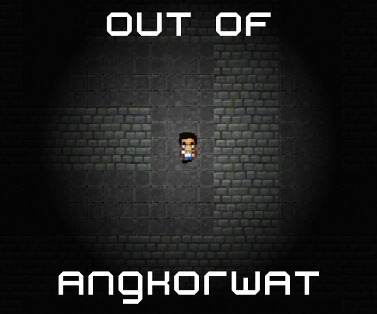

<h1 align="center">Out Of Angkorwat</h1>

  

## Description
Out of Angkorwat adalah sebuah permainan bertema labirin di mana pemain mengendalikan karakter yang dapat bergerak maju, mundur, ke kanan, dan ke kiri. Pemain akan mulai dari garis awal (start) dan harus mencapai garis akhir (finish) dengan membuka pintu. Untuk membuka pintu tersebut, pemain perlu menemukan dan mengambil sebuah kunci terlebih dahulu. Di sepanjang perjalanan dalam labirin, pemain juga akan menghadapi berbagai rintangan yang harus diatasi.

## Screenshot

